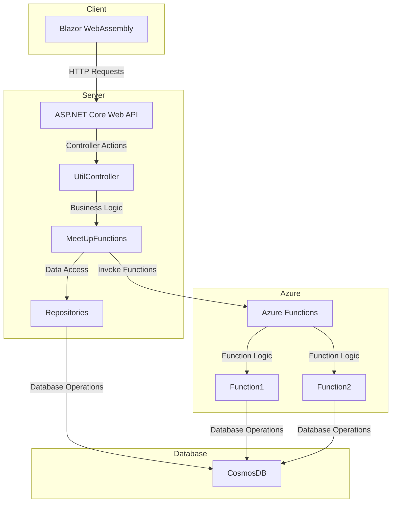

# MeetUp-Planner
Everything you need to organize and track a "MeetUp", e.g. organizing a group bike-ride. 

The first idea for this application came up during "Corona"-time: In order to arrange group bike rides or other "MeetUps" 
ensuring the traceability of the participants the corresponding tool was missing. 

Therefore the following design principles for this web-app are:
* Easy to use without complex registration and authentication process. Therefore only "keywords" are used as very basic access control.
* Responsive design, usable on PC and smartphones with all modern browsers (Chrome, Edge, Firefox, Safari) supporting the <a href="https://webassembly.org/">WebAssembly Standard</a>. 
* Minimal administrative effort: All meetups data should be deleted automatically after the configured time (typically 28 days). Everyone should be able to organize a MeetUp.
* Availability of "private" MeetUps: The ability to organize a MeetUp and protect it with a "keyword" that can be given to potential participants. 
* Adaptable: The application has a front-end layer implemented with <a href="https://docs.microsoft.com/en-us/aspnet/core/blazor">ASP.NET Core Blazor</a>  The application logic is provided via serverless <a href="https://docs.microsoft.com/en-us/azure/azure-functions/">Azure Functions</a>. In this way it is possible to use the application layer independently with a different front-end.  

# Architecture
The application is divided into two parts: 
  * The front-end is a Blazor WebAssembly application. It is a Single Page Application (SPA) that runs in the browser. The application is hosted on an Azure App Service. 
  * The back-end is a set of Azure Functions that provide the business logic for the application. The Azure Functions are hosted in an Azure Functions App. The Azure Functions are implemented in C# and use the .NET Core 3.1 runtime. The Azure Functions use Azure Cosmos DB to store the data.

# About this repository
* Folder "MeetUpFunctions" has the source code of the Azure Functions used for the backend. The master branch is CI enabled with GitHub Actions and deployed to the slot "dev" of the Azure Functions App. 
* Folder MeetUpPlanner holds the source code of the Blazor WebAssembly and the ASP.NET Core hosting app. The master branch is CI enabled with GitHub Action and deployed slot "dev" of the web application.
  * Client - The Blazor WebAssembly project
  * Server - The ASP.NET Core web backend for the application
  * Shared - Model classes shared with all projects for serializing the objects to JSON

For documentation including deployment instructions see [Wiki](https://github.com/rbrands/MeetUpPlanner/wiki)

# References
The application is build on the following technology stack:
* Blazor (see https://blazor.net) as front end based on the WebAssembly (see https://webassembly.org) standard, supported by all modern browsers (desktop and mobile). That means that the client is an application running in the browser as SPA (<a href="https://en.wikipedia.org/wiki/Single-page_application" target="_blank">Single Page Application</a>), sandboxed like JavaScript. 
* ASP.NET Core Backend (see https://docs.microsoft.com/en-us/aspnet/core/blazor/hosting-models?view=aspnetcore-3.1#blazor-webassembly)
* Business Logic in Azure Functions v3 (see https://docs.microsoft.com/en-us/azure/azure-functions/)
* Data Layer No-SQL database Azure Cosmos DB (see https://docs.microsoft.com/en-us/azure/cosmos-db/)
* To get real-time updates for MeetUps SignalR (see https://docs.microsoft.com/en-us/aspnet/core/tutorials/signalr-blazor-webassembly) is used, inspired by the example from https://www.c-sharpcorner.com/article/easily-create-a-real-time-application-with-blazor-and-signalr/ 

Some helpers:
<a href="https://github.com/Blazored">Blazored</a> is an excellent colletion with some tools to make the life easier with Blazor. MeetUpPlanner uses the TextEdit and LocalStorage components.

The Blazor Component Library from <a href="https://blazor.radzen.com/">Radzen</a> provides a comprehensive set of components used by MeetUpPlanner for notification messages and numeric input. 

Another handy tool to provide file download in Blazor: https://github.com/arivera12/BlazorDownloadFile

And of course <a href="https://getbootstrap.com/">Bootstrap</a> for the responsive design is used.

# Contributors
* Moritz von Göwels https://github.com/the-kenny - Estimating event duration for WebCal items

